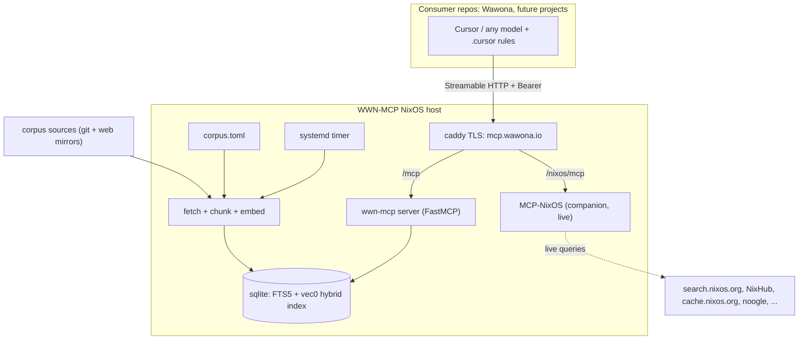

# WWN-MCP — Overview & Architecture

WWN-MCP is a local-embeddings RAG (retrieval-augmented generation) service plus
a Model Context Protocol (MCP) server. It gives any Cursor model on-demand,
retrieval-backed knowledge of the Wawona stack so it stops guessing about niche,
post-training-cutoff topics.

It is a standalone, open-source (MIT) Wawona-org project. The Wawona repo is a
*consumer* (its `.cursor/` config + rules point at the hosted server) and one of
the indexed corpus sources.

## What it knows

- The entire wayland.app / Wayland Explorer protocol set (core/stable/staging/
  experimental/unstable/wlr/kde/hyprland/cosmic/weston/treeland/river/external).
- Weston, Smithay, Sway, Cocoa-Way, iland, Pixman.
- Vulkan (MoltenVK, KosmicKrisp, Android Vulkan), OpenGL/GLES (ANGLE + per-target).
- The Linux DRM/KMS/EGL/GBM display stack (kernel `Documentation/gpu`, libdrm,
  Khronos EGL registry, Mesa GBM) — the OS contract iland reimplements on Apple.
- Apple AppKit/UIKit/WatchKit/SwiftUI/Metal/IOSurface + Liquid Glass (OS 26),
  Virtualization.framework, Containerization.framework, UTM/UTM-SE.
- macOS internals / reverse-engineering: Mach-O binary format, dyld
  (framework/.dylib loading + `DYLD_INSERT_LIBRARIES` interposing), Mach, the XNU
  kernel, launchd — how iland injects dylibs to replace WindowServer/SkyLight.
- Swift the language (The Swift Programming Language reference) + the official
  Swift MCP SDK (`modelcontextprotocol/swift-sdk`).
- Rust the language (The Rust Programming Language book) + the official Rust MCP
  SDK (`rmcp`, `modelcontextprotocol/rust-sdk`).
- XcodeGen (full Project Spec reference) — Wawona's Nix-driven `.xcodeproj`
  generator.
- crate2nix (full docs + Nix API) — splits Wawona's Rust backend crate-by-crate
  into separate Nix derivations for isolated, incremental builds.
- CI / release automation: Fastlane (TestFlight via `pilot`, Play via `supply`,
  `deliver`/`match`/`gym`/`scan`) and GitHub Actions runners (GitHub-hosted +
  self-hosted + matrix strategy) — the path to *prebuilt* downloads for testers.
- Determinate Nix (installer, FlakeHub, Magic Nix Cache, CI action) and Nix
  developer environments (`nix.dev`, `devenv`, `nix-direnv`).
- Android Jetpack Compose + Material 3 Expressive (Android 16+), NDK graphics.
- App Store Review Guidelines + Google Play policies (the strictness asymmetry).
- iOS shell App Store compliance: prior art (ios_system, a-Shell/WebAssembly,
  iSH/ash, Blink) + a curated guide to how Wawona ports zsh in-process (no
  fork/exec), its RootFS, and the sandbox-as-"container" model.
- Wawona's own `docs/`, `src/`, and the whole patched `dependencies/` tree
  (with a derived patched-software inventory).

## Architecture



## Companion: MCP-NixOS

WWN-MCP **depends on** [MCP-NixOS](https://github.com/utensils/mcp-nixos)
(`utensils/mcp-nixos`) and co-hosts it as a companion MCP server so models get
accurate, real-time Nix knowledge — nixpkgs packages/options, `nix-darwin`,
`home-manager`, flakes/FlakeHub, `noogle` function signatures, NixOS wiki +
nix.dev, package version history, and binary-cache status. It is a *live* MCP
(it queries upstream Nix services on demand), so it is **not** part of WWN-MCP's
indexed RAG corpus — the two are complementary:

- **WWN-MCP** → the Wawona stack + Wawona's *own* Nix recipes/patches (`get_patch`).
- **MCP-NixOS** → authoritative *upstream* nixpkgs/option/version facts.

The NixOS module runs it over HTTP behind the same Caddy/TLS/Bearer proxy
(default path `/nixos/mcp`); see [deployment.md](deployment.md). For local use,
Cursor can also run it directly via `uvx mcp-nixos` (no Nix required); see
[usage.md](usage.md).

### Developer-local companion: XcodeBuildMCP

For building/running/testing the Apple Xcode projects, consumer repos also wire
in [XcodeBuildMCP](https://github.com/getsentry/XcodeBuildMCP) (`xcodebuild`
tools: build, simulator, device, log capture). Unlike MCP-NixOS it is **not**
co-hosted — it requires macOS + Xcode 16+ and must run on the developer's Mac
(via `npx`/Homebrew), so it lives only in the consumer `.cursor/mcp.json`. It is
an action/build tool, not a knowledge source, so it is neither indexed nor
hosted by WWN-MCP.

## RAG pipeline

```
corpus.toml  ──▶  fetch  ──▶  chunk  ──▶  embed  ──▶  store (sqlite)  ──▶  serve (MCP)
             sources       per-file     fastembed     FTS5 + vec0          tools/resources
                          (md/code/      (BGE-small,    hybrid (RRF)
                           xml/patch)     hashing
                                          fallback)
```

1. **fetch** (`fetch.py`) — git shallow-clones and bounded web-mirror crawls
   each enabled source in `corpus.toml` into the runtime corpus cache. `local`
   sources are read in place.
2. **chunk** (`chunk.py`) — markdown-by-heading, code-by-symbol (with windowing
   fallback), one chunk per Wayland `<interface>`, whole-file patches, and
   stripped HTML/text. Each chunk carries project/path/line-range/kind/lang/tags
   and a content hash + citation URL.
3. **embed** (`embed.py`) — fastembed (ONNX CPU, BGE-small) when available; a
   deterministic hashing embedder otherwise, so the pipeline always runs.
4. **store** (`store.py`) — sqlite with FTS5 (lexical) and a `sqlite-vec` vector
   index (brute-force cosine fallback), fused with reciprocal-rank fusion.
   Indexing is incremental by content hash (upsert changed, prune stale).
5. **serve** (`server.py`) — FastMCP exposing search/protocol/patch tools and
   resources over Streamable HTTP (or stdio for local Cursor).

## Design choices

- **Local + hermetic**: no external embedding API; everything runs offline once
  the corpus is fetched. Fits the Nix/reproducibility ethos.
- **Graceful degradation**: missing `fastembed`/`sqlite-vec` never breaks the
  tool — it falls back to hashing embeddings and brute-force/FTS search.
- **Public/MIT hygiene**: only WWN-MCP's own code + `corpus.toml` + docs are
  committed. Fetched third-party docs/source live in the `.gitignore`d runtime
  data dir and are never redistributed; their licenses ride along in citations.
