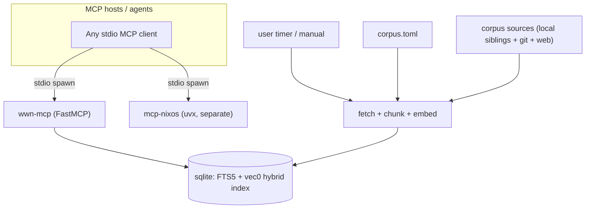

# WWN-MCP — Overview & Architecture

WWN-MCP is a local-embeddings RAG (retrieval-augmented generation) service plus
a **stdio** Model Context Protocol (MCP) server. It gives any MCP-capable agent
on-demand, retrieval-backed knowledge of the Wawona stack so it stops guessing
about niche, post-training-cutoff topics.

It is a standalone, open-source (MIT) Wawona-org project. Consumer repos (and
agent hosts) point at the local `wwn-mcp` binary; Wawona itself is also one of
the indexed corpus sources.

**Host model:** same as [mcp-nixos](https://github.com/utensils/mcp-nixos) —
the MCP host spawns `wwn-mcp` on PATH over stdio. No public URL / Streamable
HTTP. Works with Cursor, VS Code, Claude Desktop, Windsurf, Antigravity, Zed,
or any other stdio MCP client.

## What it knows

- The entire wayland.app / Wayland Explorer protocol set.
- Weston, Niri, Smithay, Sway, Cocoa-Way, iland, Pixman.
- Vulkan (MoltenVK, KosmicKrisp, Android Vulkan), OpenGL/GLES (ANGLE).
- Linux DRM/KMS/EGL/GBM (the OS contract iland reimplements on Apple).
- Apple AppKit/UIKit/WatchKit/SwiftUI/Metal/IOSurface + Liquid Glass.
- macOS internals (Mach-O, dyld, Mach, XNU, launchd).
- Swift / Rust language books + MCP SDKs.
- XcodeGen, crate2nix, Fastlane, GitHub Actions, Determinate Nix.
- Android Jetpack Compose + Material 3, NDK graphics.
- App Store / Play policies; Wawona Runtime Wasm packages (not StoreKit apt).
- Wawona integration + extracted `wwn-*` repos (toolchain, iland, weston,
  niri, kmscube, waypipe, anowaW, vms, containers, ssh, zsh, wasm, …).

## Architecture


```mermaid
flowchart TD
  subgraph consumers [MCP hosts / agents]
    Host["Any stdio MCP client"]
  end
  Host -->|"stdio spawn"| Server["wwn-mcp (FastMCP)"]
  Server --> DB[("sqlite: FTS5 + vec0 hybrid index")]
  Timer["user timer / manual"] --> Ingest["fetch + chunk + embed"]
  Ingest --> DB
  Manifest["corpus.toml"] --> Ingest
  Sources["corpus sources (local siblings + git + web)"] --> Ingest
  Host -->|"stdio spawn"| NixOS["mcp-nixos (uvx, separate)"]
```

## Companion: MCP-NixOS

WWN-MCP does **not** co-host MCP-NixOS. Run it as a separate MCP server if you
want live nixpkgs/options:

```json
{ "nixos": { "command": "uvx", "args": ["mcp-nixos"] } }
```

- **WWN-MCP** → Wawona stack + `wwn-*` repos (`get_patch` / `list_patches`).
- **MCP-NixOS** → live upstream nixpkgs/option/version facts.

### Developer-local: XcodeBuildMCP + lldb-mcp

Optional macOS-only action tools in the host MCP config. Curated guides in
`knowledge/wawona/` (DAG, graphics, Mode A/B, platform matrix, device workflow,
lldb-mcp reference).

## RAG pipeline

```
corpus.toml  ──▶  fetch  ──▶  chunk  ──▶  embed  ──▶  store (sqlite)  ──▶  serve (stdio)
             sources       per-file     fastembed     FTS5 + vec0          tools/resources
                          (md/code/      (BGE-small,    hybrid (RRF)
                           xml/patch)     hashing
                                          fallback)
```

First empty serve auto-indexes shipped `knowledge/`.

## Design choices

- **Local + hermetic**: no external embedding API.
- **Graceful degradation**: missing fastembed/sqlite-vec → hashing + FTS.
- **Public/MIT hygiene**: fetched third-party docs stay in the runtime data dir.
- **stdio only**: no HTTP transport to maintain.
